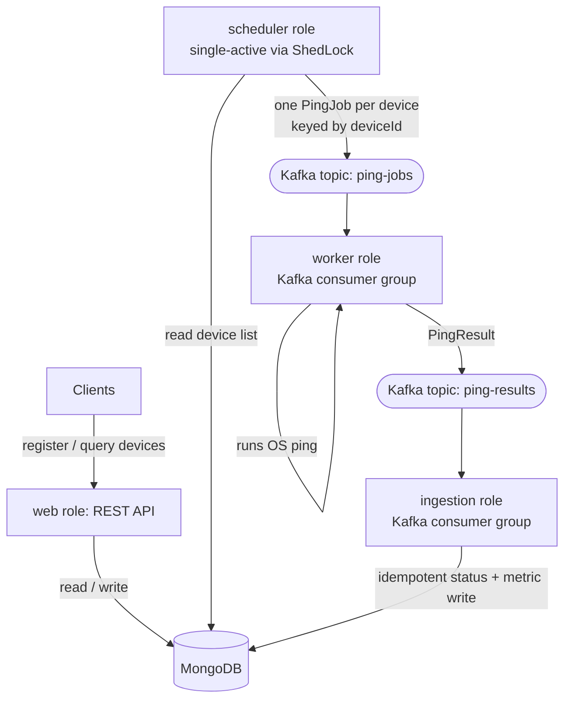

# mini-nms — Distributed Network Monitoring System

A network monitoring service that periodically pings registered devices, records their up/down status and latency, and exposes the data over a REST API. It started life as a single-node monolith with a timer loop and has been re-architected into a **horizontally-scalable, fault-tolerant distributed system** built on Spring Boot, Apache Kafka, and MongoDB.

The same monitoring loop is split into independently scalable roles that communicate over a message bus: a **scheduler** dispatches work, a pool of **workers** performs the pings, and an **ingestion** consumer persists the results. All roles ship in a single JAR and are selected at launch via Spring profiles.

---

## Table of contents

- [What it does](#what-it-does)
- [Architecture](#architecture)
- [Tech stack](#tech-stack)
- [Prerequisites](#prerequisites)
- [Quick start (single process)](#quick-start-single-process)
- [Running in distributed mode](#running-in-distributed-mode)
- [Configuration](#configuration)
- [REST API reference](#rest-api-reference)
- [Data model](#data-model)
- [How a ping flows through the system](#how-a-ping-flows-through-the-system)
- [Observing the system](#observing-the-system)
- [Project structure](#project-structure)
- [Troubleshooting](#troubleshooting)
- [Roadmap](#roadmap)
- [License](#license)

---

## What it does

- Register network devices (name + IPv4 address) through a REST API.
- Every 60 seconds, ping each registered device, measuring **status** (`UP`/`DOWN`), **latency**, and **packet loss**.
- Persist the current status on each device and a time-series of `NetworkMetric` snapshots.
- Query a device's status and its historical metrics (latest, all, or within a time range) over REST.

The work is distributed so that monitoring survives a node dying, scales by adding more worker instances, and never double-pings even when multiple instances run.

---

## Architecture



### Roles

All four roles are the same JAR; the active Spring profile decides which beans start.

| Role | Profile | Responsibility | Scaling |
|------|---------|----------------|---------|
| Scheduler | `scheduler` | On a 60s timer, reads the device list and publishes one `PingJob` per device to `ping-jobs`. Does no pinging. | Run many; **ShedLock** ensures only one dispatches per cycle. |
| Worker | `worker` | Consumes `ping-jobs`, runs the actual OS ping, publishes a `PingResult` to `ping-results`. | Scale freely — Kafka distributes partitions across the consumer group. |
| Ingestion | `ingestion` | Consumes `ping-results`, writes device status and a metric snapshot to MongoDB. | Scale freely. |
| Web | `web` | Hosts the REST API for managing devices and reading metrics. | Run behind a load balancer as needed. |

### Why it's built this way

- **No single point of failure.** Kill any node and the others keep working; Kafka reassigns a dead worker's partitions automatically.
- **Horizontal scale.** Pinging is blocking I/O and was the bottleneck. Workers are a Kafka consumer group, so adding instances adds throughput up to the topic's partition count.
- **Safe to run multiple copies.** The scheduler is the only component that must be single-active; ShedLock (a MongoDB-backed distributed lock) guarantees only one instance dispatches per cycle, so no duplicate pings or status thrashing.
- **Ordered per device.** Messages are keyed by `deviceId`, so all jobs and results for one device land on the same Kafka partition and are processed in order.
- **Resilient ingestion.** Status writes are idempotent targeted updates, safe to apply twice under Kafka's at-least-once delivery.

---

## Tech stack

- **Java 21**, **Spring Boot 4.x**
- **Apache Kafka** (event bus) via Spring Kafka
- **MongoDB** (device + metric storage)
- **ShedLock** (MongoDB-backed distributed scheduler lock)
- **Spring Web MVC** (REST), **Spring Boot Actuator** (health), **Bean Validation**
- **Lombok**
- **Maven** (wrapper included)

---

## Prerequisites

- **JDK 21** (the build targets Java 21).
- **Docker** (to run MongoDB and Kafka locally).
- A running **MongoDB** and **Apache Kafka** broker.
- Maven is not required globally — use the bundled `./mvnw` wrapper.

> **Note on pinging:** the worker shells out to the operating system's `ping` command. On a normal host this works out of the box. Inside a container you must install `iputils-ping` and grant the `NET_RAW` capability (see [Troubleshooting](#troubleshooting)).

---

## Quick start (single process)

This runs all four roles in one JVM — handy for development. It behaves like the original monolith but routes work through Kafka.

```bash
# 1. Start MongoDB
docker run -d --name nms-mongo -p 27017:27017 mongo:8.0

# 2. Start a single-broker Kafka (KRaft) using the provided file
docker compose -f kafka-dev.yml up -d

# 3. Build
./mvnw clean package -DskipTests

# 4. Run all roles in one process via the "local" profile group
java -jar target/demo-0.0.1-SNAPSHOT.jar --spring.profiles.active=local
```

The API is now at `http://localhost:8080`. Register a device and watch metrics accumulate:

```bash
curl -X POST http://localhost:8080/api/devices \
  -H "Content-Type: application/json" \
  -d '{"name":"Google DNS","ipAddress":"8.8.8.8"}'
```

> The build produces `target/demo-0.0.1-SNAPSHOT.jar` (the Maven `artifactId` is `demo`). Adjust the jar name in the commands if you rename the artifact.

---

## Running in distributed mode

To see the system actually distribute work, run each role as its own process. Every instance starts a web server, so give each a distinct `--server.port` when running on one host.

```bash
# Web + scheduler (the API and the dispatcher)
java -jar target/demo-0.0.1-SNAPSHOT.jar --spring.profiles.active=web,scheduler --server.port=8080

# Two workers — they share one consumer group and split the partitions
java -jar target/demo-0.0.1-SNAPSHOT.jar --spring.profiles.active=worker --server.port=8081
java -jar target/demo-0.0.1-SNAPSHOT.jar --spring.profiles.active=worker --server.port=8082

# Ingestion
java -jar target/demo-0.0.1-SNAPSHOT.jar --spring.profiles.active=ingestion --server.port=8083
```

Things to try:

- **Scale workers:** start a third worker and watch the worker logs show a Kafka consumer-group rebalance as partitions redistribute. Kill one worker and its partitions are reassigned within seconds — no monitoring lost.
- **Fault-tolerant scheduler:** start a second `scheduler` instance. Only one ever logs `Dispatched N ping job(s)` per cycle — ShedLock at work.

---

## Configuration

Configuration lives in `src/main/resources/application.properties`. Key settings:

| Property | Default | Purpose |
|----------|---------|---------|
| `server.port` | `8080` | HTTP port (override per instance with `--server.port`). |
| `spring.data.mongodb.host` | `localhost` | MongoDB host. |
| `spring.data.mongodb.port` | `27017` | MongoDB port. |
| `spring.data.mongodb.database` | `nms_db` | MongoDB database name. |
| `spring.kafka.bootstrap-servers` | `localhost:9092` | Kafka broker(s). Overridable via `SPRING_KAFKA_BOOTSTRAP_SERVERS`. |
| `spring.profiles.group.local` | `scheduler,worker,ingestion,web` | Convenience group that activates all roles. |

Kafka serialization (JSON), consumer factories, and the topic admin are defined in code (`KafkaConfig.java`), not in properties — only the broker address is read from configuration.

**Active profile is required.** Launching with no profile starts none of the roles (no API, no scheduler). Always pass `--spring.profiles.active=...` (use `local` for everything in one process).

---

## REST API reference

Base URL: `http://localhost:8080`

### Devices

| Method | Path | Description | Success |
|--------|------|-------------|---------|
| `POST` | `/api/devices` | Register a device. Body: `{ "name": "...", "ipAddress": "..." }` | `201 Created` + device |
| `GET` | `/api/devices` | List all devices. | `200 OK` |
| `GET` | `/api/devices/{id}` | Get one device by id. | `200 OK` |
| `DELETE` | `/api/devices/{id}` | Delete a device. | `200 OK` |

### Metrics

| Method | Path | Description |
|--------|------|-------------|
| `GET` | `/api/metrics/{deviceId}/latest` | The latest 10 ping results for a device. |
| `GET` | `/api/metrics/{deviceId}/all` | All metrics for a device. |
| `GET` | `/api/metrics/{deviceId}/range?start={iso}&end={iso}` | Metrics between two ISO-8601 timestamps. |

### Examples

```bash
# Register a device
curl -X POST http://localhost:8080/api/devices \
  -H "Content-Type: application/json" \
  -d '{"name":"Main Router","ipAddress":"192.168.1.1"}'

# List devices
curl http://localhost:8080/api/devices

# Latest 10 metrics for a device
curl http://localhost:8080/api/metrics/<deviceId>/latest

# Metrics in a time range
curl "http://localhost:8080/api/metrics/<deviceId>/range?start=2026-06-07T00:00:00&end=2026-06-07T23:59:59"
```

### Validation & error responses

Requests are validated (`name` must not be blank; `ipAddress` must be a valid IPv4 address). Errors return a JSON body with `timestamp`, `status`, `error`, and `message`:

| Situation | HTTP status |
|-----------|-------------|
| Validation failure | `400 Bad Request` (with `fieldErrors`) |
| Device not found | `404 Not Found` |
| Duplicate IP address | `409 Conflict` |
| Concurrent modification conflict | `409 Conflict` |
| Unexpected error | `500 Internal Server Error` |

### Health

Spring Boot Actuator is enabled: `GET /actuator/health`.

---

## Data model

### Device (`devices` collection)

| Field | Type | Notes |
|-------|------|-------|
| `id` | String | Mongo `_id`. |
| `version` | Long | Optimistic-locking version. |
| `name` | String | Display name. |
| `ipAddress` | String | IPv4 address (unique). |
| `status` | String | `UP`, `DOWN`, or `UNKNOWN` (initial). |
| `createdAt` | DateTime | Set on creation. |
| `lastChecked` | DateTime | Updated each ping cycle. |

A device created through the API starts as `UNKNOWN` and is updated to `UP`/`DOWN` after its first ping cycle.

### NetworkMetric (`network_metrics` collection)

| Field | Type | Notes |
|-------|------|-------|
| `id` | String | Mongo `_id`. |
| `deviceId` | String | Owning device id. |
| `ipAddress` | String | Pinged address. |
| `latencyMs` | double | Average round-trip latency (`-1` if unavailable). |
| `packetLoss` | double | Percentage lost (`100.0` if down). |
| `status` | String | `UP` / `DOWN`. |
| `timestamp` | DateTime | When the snapshot was recorded. |

ShedLock also maintains a `shedLock` collection in the same database for the scheduler lock.

---

## How a ping flows through the system

1. **Scheduler** wakes every 60s (guarded by ShedLock so only one instance proceeds), reads all devices, and publishes one `PingJob {deviceId, ipAddress}` to `ping-jobs`, keyed by `deviceId`.
2. **Workers** in the `ping-worker-group` consumer group pick up jobs (partitions split across instances), run the OS `ping` (4 packets, 5s timeout), parse latency and packet loss, and publish a `PingResult` to `ping-results`, again keyed by `deviceId`.
3. **Ingestion** consumers in the `ingestion-group` read results, update the device's `status` and `lastChecked` with an idempotent targeted MongoDB update, and append a `NetworkMetric` snapshot.
4. **Web** serves the current state from MongoDB over REST.

Keying by `deviceId` keeps each device's events on a single partition, so status transitions are applied in order even with many workers.

---

## Observing the system

```bash
# Consumer group lag for the worker pool
docker exec kafka /opt/kafka/bin/kafka-consumer-groups.sh \
  --bootstrap-server localhost:9092 --describe --group ping-worker-group

# Inspect data in MongoDB
mongosh
> use nms_db
> db.devices.find()
> db.network_metrics.countDocuments()
> db.shedLock.find()        // the scheduler lock document
```

---

## Project structure

```
com.nms
├── NmsApplication.java          # Spring Boot entry point (@EnableScheduling)
├── config/                      # KafkaConfig, KafkaTopicConfig, ShedLockConfig
├── controller/                  # DeviceController, MetricController        [web]
├── dto/                         # DeviceRequestDTO, DeviceResponseDTO
├── exception/                   # custom exceptions + GlobalExceptionHandler
├── ingestion/                   # ResultIngestionConsumer                   [ingestion]
├── messaging/                   # PingJob, PingResult (Kafka message records)
├── model/                       # Device, NetworkMetric
├── repository/                  # DeviceRepository, NetworkMetricRepository
├── scheduler/                   # PingScheduler                             [scheduler]
├── service/                     # DeviceService, MetricService, PingService
└── worker/                      # PingWorker                                [worker]
```

---

## Troubleshooting

**`/api/devices` returns 404 / `NoResourceFoundException`.**
No profile is active, so the controllers (gated by `@Profile("web")`) never registered. Launch with `--spring.profiles.active=web` (or `local`).

**`E11000 duplicate key error` on the `devices` collection during a ping cycle.**
A device document is missing its `version` field, so Spring Data treats it as new and tries to insert it. Create devices through the API (which sets `version`), or backfill existing ones:
```javascript
db.devices.updateMany({ version: null }, { $set: { version: NumberLong(0) } })
```

**`required a bean of type 'org.springframework.kafka.core.KafkaTemplate' that could not be found`.**
The Kafka producer/consumer beans are defined explicitly in `KafkaConfig.java`. Ensure that class is present and on the component-scan path.

**Jackson `TypeReference` compile error (`com.fasterxml.jackson.core.type.TypeReference not found`).**
Spring Boot 4 defaults to Jackson 3 (`tools.jackson.*`), while Spring Kafka's JSON serializers reference Jackson 2 (`com.fasterxml.jackson.*`). Ensure a Jackson 2 `jackson-databind` dependency is on the classpath.

**Pings always report `DOWN` inside Docker.**
The container lacks the `ping` binary or the capability to send ICMP. Install `iputils-ping` in the worker image and run the container with the `NET_RAW` capability (or the unprivileged `net.ipv4.ping_group_range` sysctl).

**Container build/run fails on Java version.**
The build targets Java 21 — make sure both the build and runtime base images are JDK/JRE 21.

---

## Roadmap

Implemented (Tier 1 — the distributed core): event-driven decomposition over Kafka, ShedLock single-active scheduler, profile-based roles.

Planned:

- **Concurrent pinging** inside each worker using Java 21 virtual threads (blocking I/O fan-out).
- **Redis cache** (cache-aside) for device status and latest metrics.
- **Resilience4j** — circuit breaker, retry with backoff, bulkhead, timeout around pings and datastore calls.
- **Time-series retention** — MongoDB TTL index and/or rollups to bound metric growth.
- **Observability** — Micrometer → Prometheus → Grafana, plus OpenTelemetry tracing across the Kafka boundary.
- **Real-time dashboard** — a web UI with WebSocket/SSE push (currently API-only).
- **Full container orchestration** — a single Docker Compose / Kubernetes setup running all roles plus Kafka, MongoDB, and Redis.

---

## Author

Ankit Kumar

Contact Information: 
LinkedIn: https://www.linkedin.com/in/ankit-kumar-5a447627b/
email: ankitkumar220520041@gmail.com

